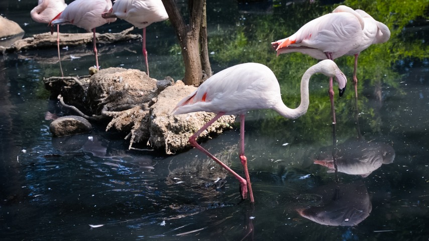

# objects-removal

For more, pls refer to
[CVPR 2019 Paper](https://arxiv.org/abs/1905.02884) | [Project Page](https://nbei.github.io/video-inpainting.html) | [YouTube](https://www.youtube.com/watch?v=LIJPUsrwx5E) | [BibeTex](#citing)


## environment

Centos7 / CUDA9 / CUDNN7 / Python3.6

**To Install python virtua environments**
```
virtualenv --python=/usr/local/python3/bin/python3 deepflow
```
## Install & Requirements
The code has been tested on pytorch=0.4.0 and python3.6. Please refer to `requirements.txt` for detailed information. 

**To Install python packages**
```
pip install -r requirements.txt
```
**To Install flownet2 modules**
```
bash install_scripts.sh
```
## Componets
There exist three components in this repo:
* Video Inpainting Tool: DFVI
* Extract Flow: FlowNet2(modified by [Nvidia official version](https://github.com/NVIDIA/flownet2-pytorch/tree/python36-PyTorch0.4))
* Image Inpainting(reimplemented from [Deepfillv1](https://github.com/JiahuiYu/generative_inpainting))

## Usage:
* To use our video inpainting tool for object removing, we recommend that the frames should be put into `xxx/video_name/frames`
and the mask of each frame should be put into `xxx/video_name/masks`. 
And please download the resources of the demo and model weights from [here](https://drive.google.com/drive/folders/1a2FrHIQGExJTHXxSIibZOGMukNrypr_g?usp=sharing).
An example demo containing frames and masks has been put into the demo and running the following command will get the result:
```
python tools/video_inpaint.py --frame_dir ./demo/frames --MASK_ROOT ./demo/masks --image_size 512 832 --FlowNet2 --DFC --ResNet101 --Propagation 
```


We provide the original model weight used in our movie demo which use ResNet101 as backbone and other related weights pls download from [here](). 
Please refer to [tools](https://github.com/nbei/release-DFVI/tree/master/tools) for detailed use and training settings. 
* To extract flow for videos:
```
python tools/infer_flownet2.py --frame_dir xxx/video_name/frames
```
* To use the Deepfillv1-Pytorch model for image inpainting,
```
python tools/frame_inpaint.py --test_img xxx.png --test_mask xxx.png --image_shape 512 512
```
<center class="half">
    
</center>

result：


